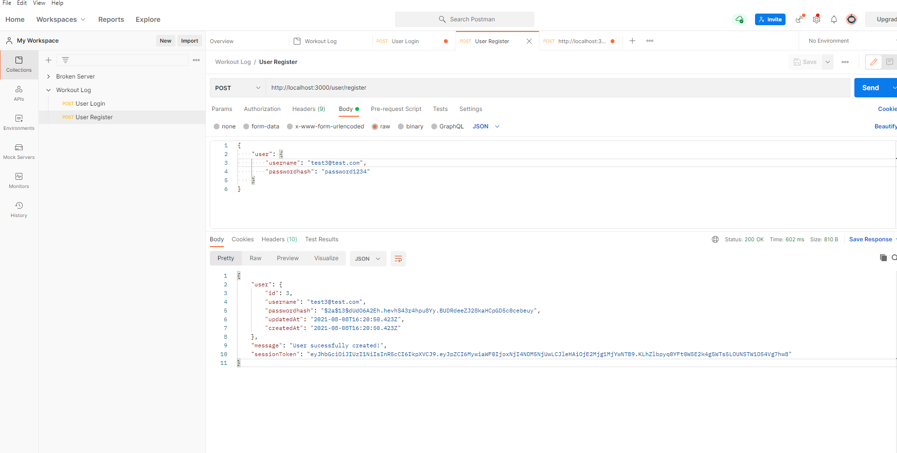
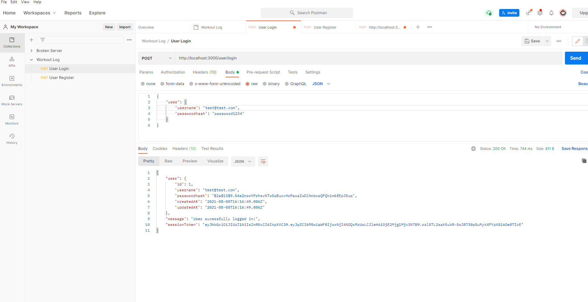
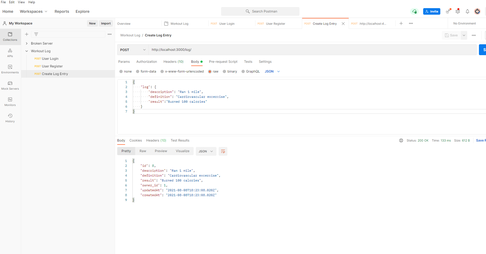
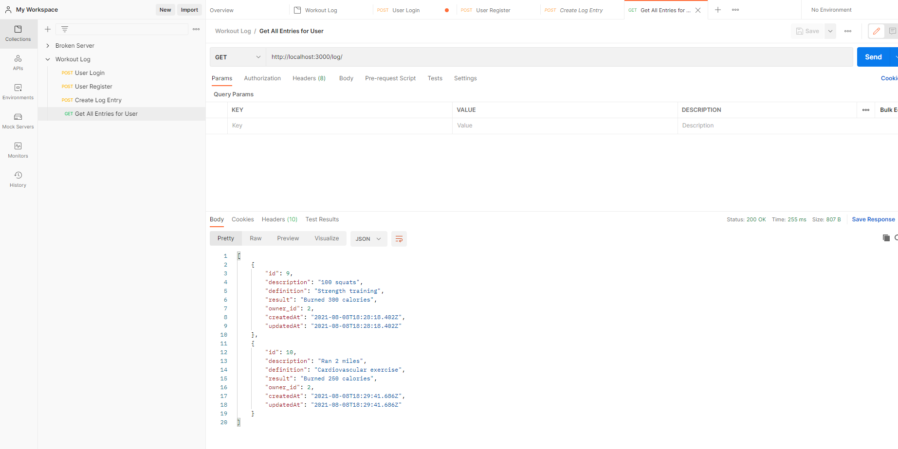
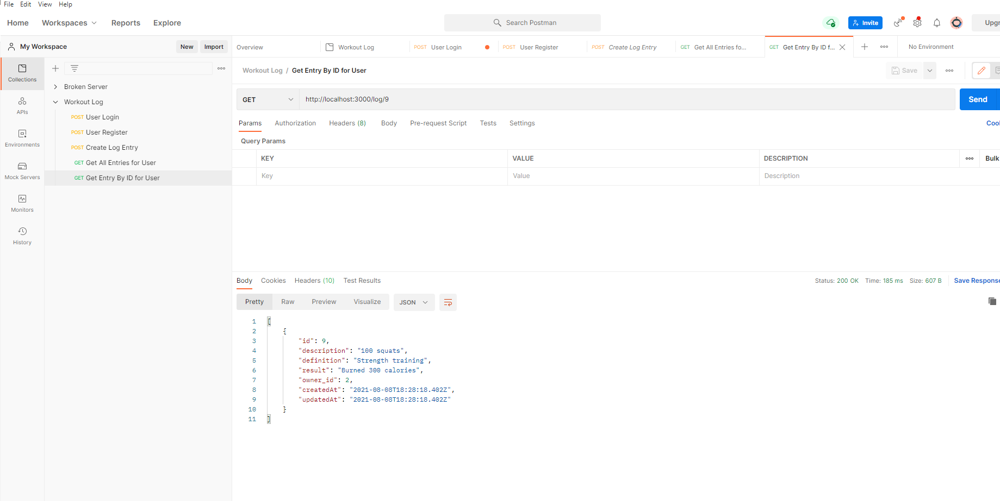
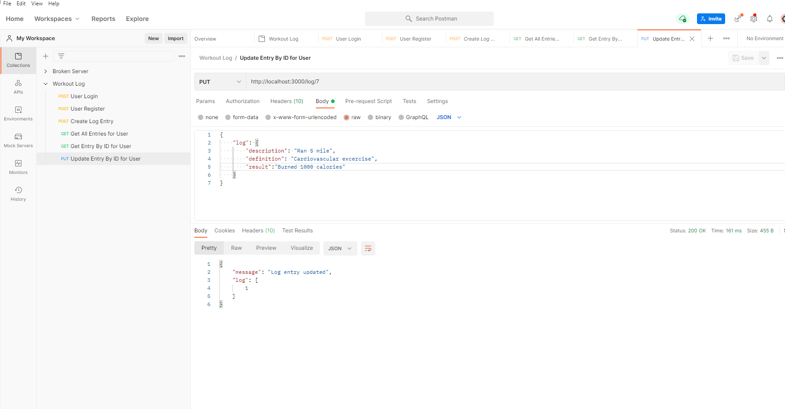
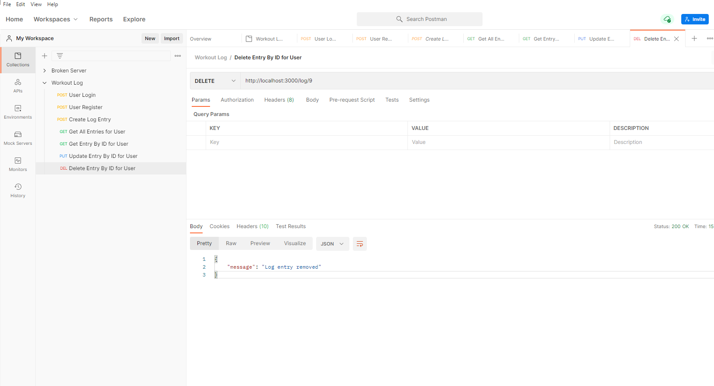

# Workout Server

- app.js
- db.js
- .env
- .gitignore

- Controllers
    - user controller
    - log controller

- Middleware
    - validate session

- Models
    - user
    - log

# Postman Screens
<h2>User Register</h2>

<h2>User Login</h2>

<h2>Create workout log entry</h2>

<h2>Get all log entries for a user</h2>

<h2>Get individual log for user by ID</h2>

<h2>Update individual log for user by ID</h2>

<h2>Delete individual log for user by ID</h2>

